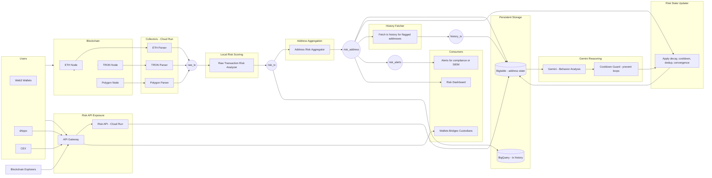

Schemas is 

```mermaid
flowchart LR
    %% ========= INGESTION =========

    subgraph Users
    A[Web3 Wallets]
    B[dApps]
    C[CEX]
    end

    D[Blockchain Explorers]

    subgraph Blockchain
    N1[ETH Node]
    N2[TRON Node]
    N3[Polygon Node]
    end

    subgraph Ingestion["Collectors - Cloud Run"]
    IC1[ETH Parser]
    IC2[TRON Parser]
    IC3[Polygon Parser]
    end

    Users --> Blockchain
    Blockchain --> N1
    Blockchain --> N2
    Blockchain --> N3

    N1 --> IC1
    N2 --> IC2
    N3 --> IC3

    IC1 --> RT(raw_tx)
    IC2 --> RT
    IC3 --> RT

    %% ========= STREAMING TOPICS =========
    RT((raw_tx))
    RTX((risk_tx))
    RA((risk_address))
    HTX((history_tx))
    ALERT((risk_alerts))

    %% ========= CORE PROCESSING =========
    subgraph FirstPass["Local Risk Scoring"]
    RTRA[Raw Transaction Risk Analyzer]
    end

    RT --> RTRA --> RTX

    subgraph Aggregation["Address Aggregation"]
    ARA[Address Risk Aggregator]
    end

    RTX --> ARA --> RA

    %% ========= STATE & HISTORY =========
    subgraph State["Persistent Storage"]
    BT[(Bigtable - address state)]
    BQ[(BigQuery - tx history)]
    end

    RA --> BT
    RTX --> BQ

    %% ========= STATE UPDATER =========
    subgraph Stabilization["Risk State Updater"]
    RSU[Apply decay, cooldown, dedup, convergence]
    end

    RA --> RSU --> BT

    %% ========= HISTORY LOOKUP =========
    subgraph HistoryBuilder["History Fetcher"]
    HRP[Fetch tx history for flagged addresses]
    end

    RA --> HRP --> HTX
    HTX --> BT

    %% ========= GEMINI ANALYSIS =========
    subgraph GeminiBlock["Gemini Reasoning"]
    GEM[Gemini - Behavior Analysis]
    GUARD[Cooldown Guard - prevent loops]
    end

    BT --> GEM --> GUARD --> RSU

    %% ========= API EXPOSURE =========
    subgraph APILayer["Risk API Exposure"]
    APIGW[API Gateway]
    RAPI[Risk API - Cloud Run]
    end

    Users --> APIGW --> RAPI --> BT
    D --> APIGW
    C --> APIGW
    B --> APIGW

    %% ========= OUTPUT CONSUMERS =========
    subgraph Outputs["Consumers"]
    UI[Risk Dashboard]
    SOC[Alerts for compliance or SIEM]
    PARTNERS[Wallets Bridges Custodians]
    end

    RA --> ALERT --> SOC
    RA --> UI
    APIGW --> PARTNERS

```