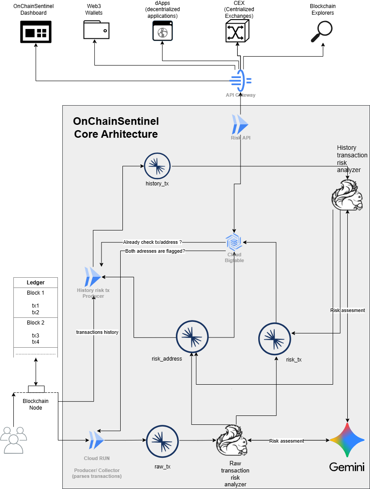
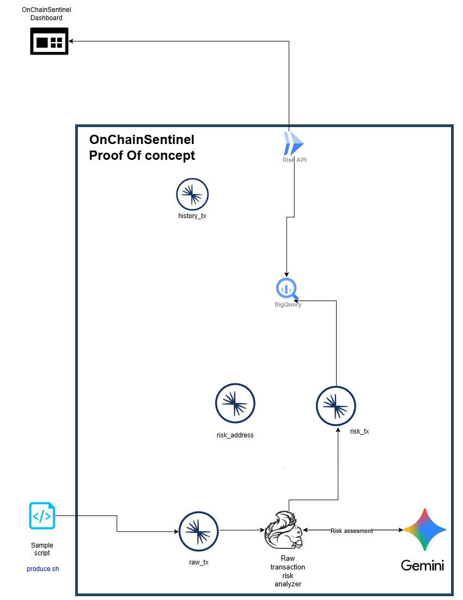

<picture>
  <source media="(prefers-color-scheme: dark)" srcset="assets/logo-dark.png">
  <source media="(prefers-color-scheme: light)" srcset="assets/logo-light.png">
  
</picture>

<!-- ## Table of Contents
1. 📝 [Description](#-description)
2. ✏️ [Architecture](#%EF%B8%8F-architecture)
3. 🧩 [Proof of concept](#-proof-of-concept)
4. 🛠️ [Setup](#%EF%B8%8F-setup)
5. 🚀 [Deploy](#-deploy)
   - [Create resources in Confluent Cloud](#create-resources-in-confluent-cloud)
   - [Create BigQuery in GCP](#create-bigquery-in-gcp)
    - [Deploy CloudRun risk_api ](#deploy-cloudrun-risk_api)
6. 💣 [Destroy](#-destroy)
   - [Destroy Resource Confluent Cloud](#destroy-resource-confluent-cloud)
   - [Destroy Resource GCP](#destroy-resource-gcp)
     - ⛃ [Destroy BigQuery](#-destroy-bigquery)
7. 🧪 [End to end test](#-end-to-end-test)

## 📝 Description
This repository contains a minimal Proof of Concept demonstrating:
- Real-time behavior ingestion (Kafka)
- Risk assesment through Gemini API remote model -->

## ✏️ Architecture
<picture>
  <source media="(prefers-color-scheme: dark)" srcset="assets/arhitecture-dark.png">
  <source media="(prefers-color-scheme: light)" srcset="assets/arhitecture-light.png">
  
</picture>

---

<!-- ## 🧩 Proof of concept
<picture>
  <source media="(prefers-color-scheme: dark)" srcset="assets/poc-dark.png">
  <source media="(prefers-color-scheme: light)" srcset="assets/poc-light.png">
  
</picture> -->

---


## 🛠️ SETUP

For this project we use confluent and google cloud (gcloud) cli.

As components we use:
1. Confluent Cloud 
 - Kafka 
 - Flink AI
2. Google Cloud Platform 
  - Gemini API exposure
  - Cloud Run
  - BigQuery

Extra details:
 We created schemas, logo using draw.io (Check ./assets/OnChainSentinel.drawio)


## 🚀 Deploy

Here will make in steps as we need to deploy in both Google Cloud and Confluent Cloud
### Create resources in Confluent Cloud


### Create BigQuery in GCP


### Deploy CloudRun risk_api 


## 💣 Destroy

We have two components that we must destroy resources

### Destroy Resource Confluent Cloud
We can simply call that just deletes the environment and all the resources will be deleted.
```
destroy.sh
```

### Destroy Resource GCP

#### ⛃ Destroy BigQuery 

---

## 🧪 END TO END TEST

### Run producer once
```
producer.sh
```